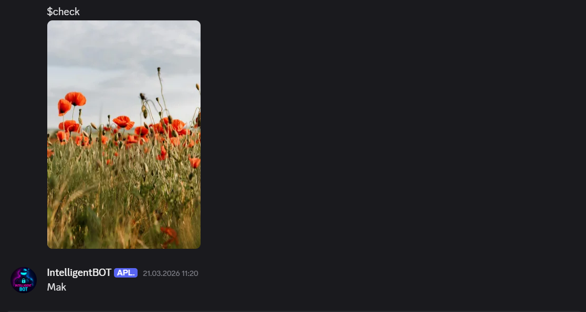

**🤖 AI Image Classifier Discord Bot**
Inteligentny bot na platformę Discord, który potrafi "widzieć"! Wykorzystuje on model uczenia maszynowego (Deep Learning) stworzony w Keras/TensorFlow, aby rozpoznawać zawartość obrazów przesyłanych przez użytkowników.

**🌟 Główne Funkcje:**
- Klasyfikacja obrazów w czasie rzeczywistym: Po wysłaniu obrazka z komendą $check, bot analizuje go i zwraca nazwę rozpoznanego obiektu.
- Przyjazny interfejs: Proste komendy tekstowe do interakcji z botem.

**🛠️ Technologie i Biblioteki**
Projekt został zbudowany przy użyciu:
- Python: 3.11
- discord.py==2.6.3
- tf-keras==2.21.0
- Pillow==12.1.1
- numpy==2.4.3

**📂 Struktura Projektu**
- main.py – Serce bota, obsługuje komendy i komunikację z Discordem.

- model.py – Moduł logiczny, w którym odbywa się magia AI i analiza zdjęcia.

- keras_model.h5 – Wytrenowany model (binarny).

- labels.txt – Lista kategorii, które model potrafi rozpoznać.

**🎮 Jak korzystać z bota?**
Korzystanie z bota jest proste i intuicyjne. Postępuj zgodnie z poniższymi krokami:
```
1. Przygotowanie obrazu
- Upewnij się, że masz przygotowane zdjęcie, które chcesz sklasyfikować (np. w formacie .jpg lub .png).

2. Wywołanie klasyfikacji
- Aby bot przeanalizował Twój obraz:
- Przeciągnij i upuść zdjęcie do okna czatu na Discordzie (tam, gdzie jest bot).
- W opisie zdjęcia (podpisie) wpisz komendę:
$check
- Wyślij wiadomość.

3. Wynik analizy
- Bot automatycznie:
- Pobierze załączone zdjęcie.
- Przetworzy je przez model sieci neuronowej.
- Odeśle wiadomość z nazwą rozpoznanej kategorii (np. Mak, stokrotka, tulipan).


